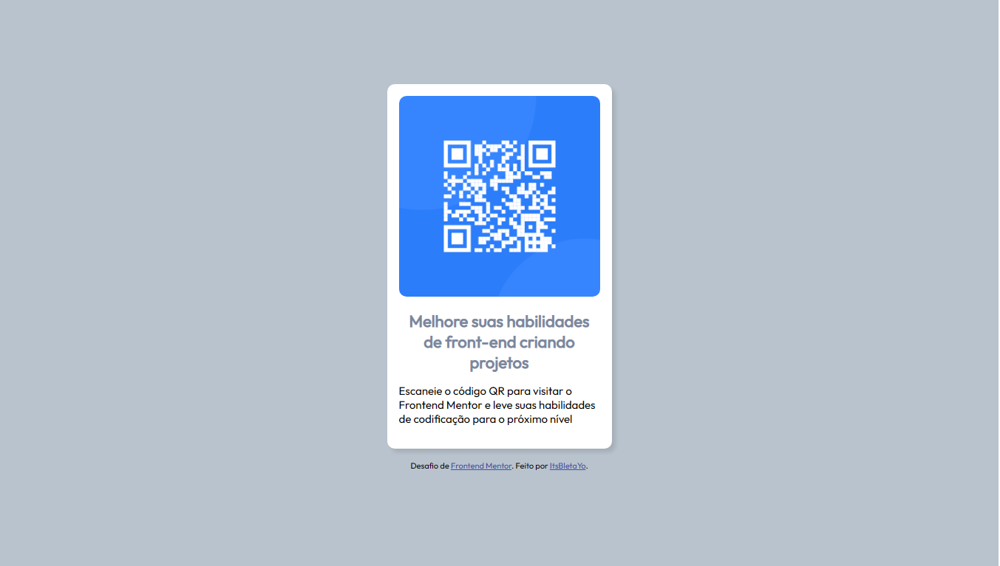

# Frontend Mentor - solução de componente de QR Code

Esta é uma solução para o [desafio do componente de código QR no Frontend Mentor](https://www.frontendmentor.io/challenges/qr-code-component-iux_sIO_H). Os desafios do Frontend Mentor ajudam você a melhorar suas habilidades de codificação criando projetos realistas. 

## Tabela de conteúdos:

- [Visão Geral](#visao-geral)
  - [Screenshots](#screenshots)
  - [Links](#links)
- [Meu processo](#meu-processo)
  - [Feito com](#feito-com)
- [Author](#author)

## Visão Geral

### Screenshots

### Links

- Solução URL: [Add solution URL here](https://your-solution-url.com)
- Live Site URL: [Add live site URL here](https://your-live-site-url.com)

## Meu processo

### Feito com

- Marcação HTML5 semântica
- Propriedades personalizadas CSS
- Flexbox
- Grade CSS

## Autor

- Github - [ItsBletaYo](https://github.com/ItsBletaYo/)